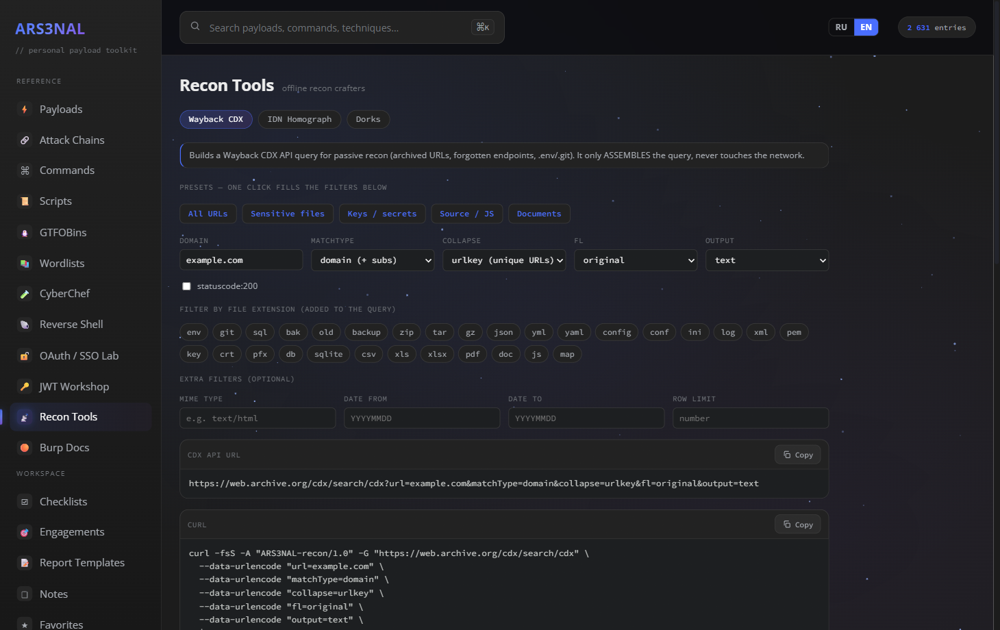
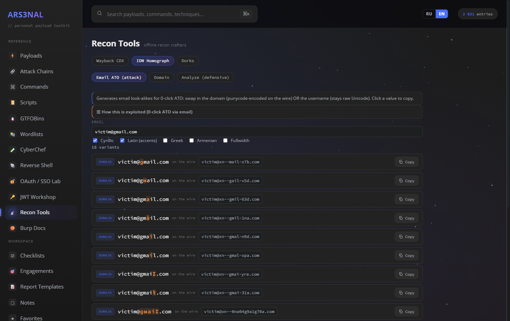

<h1 align="center">ARS3NAL</h1>

<p align="center"><b>English</b> · <a href="README.ru.md">Русский</a></p>

<p align="center">
  <b>A local, offline-first arsenal for pentesting &amp; bug bounty.</b><br>
  Clickable attack chains, payloads, a click-to-build command generator, GTFOBins, ready-to-run
  scripts, wordlists, an embedded CyberChef, reverse shells, a Burp reference, operational
  checklists and an engagement tracker. One fast, searchable, editable app that runs on your machine.
</p>

<p align="center">
  
  
  
  
</p>

<p align="center"><b>▶ <a href="https://inflictx.github.io/Arsenal/">Live demo</a></b> — runs entirely in your browser, nothing to install (your data stays in your browser).</p>


> No telemetry. No cloud. No account. Your data lives in a local SQLite file and never
> leaves the box. Stop juggling 30 browser tabs and a folder of `.md` cheatsheets.

> ⚠️ **For authorized security testing and education only.** See [Disclaimer](#-disclaimer).

> 🌐 **Bilingual (Russian / English)** — a one-click toggle switches the interface and most
> reference content (payloads, GTFOBins, commands, Burp docs, wordlists) between RU and EN.
> Payloads, commands and code themselves stay technical.

---

## ✨ Highlights

### 🔗 Attack Chains: from a finding to impact, step by step *(new)*
92 curated, clickable kill-chains across 11 categories (IDOR / access control, recon, injection,
OAuth / SSO, SSRF, client-side XSS / CSRF, auth / 2FA / logic, file upload / LFI, API / GraphQL,
modern web, AI / LLM). Each chain is tagged by level (Newbie / Intermediate / Advanced) so a
newcomer can start easy and climb. Every step is a goal plus a concrete payload or command, with a
one-click jump straight into the matching Payloads / Scripts / Commands entry, and they are grounded
in real CVEs and disclosed reports. Paste your two accounts, client_id or redirect_uri into the
context tokens and the steps fill themselves in.

### 🛰️ Recon Tools: Wayback CDX, IDN homograph email-ATO, dorks *(new)*
Three offline recon crafters that only assemble what *you* run. A **Wayback CDX query builder**
(match types, extension filters, presets) with copy-paste post-processing recipes (gau/waybackurls
harvest, `uro` dedup, `gf` classification, `id_` deleted-file recovery, PDF secret scan). An **IDN
homograph generator** for 0-click account takeover via punycode email: it crafts the domain-part and
username-part look-alikes plus their on-the-wire form and the full attack workflow, with a defensive
analyzer that decodes `xn--` and flags confusables. And a **dork builder** with 20 Google categories
plus GitHub code-search and Shodan pivots.

<p>
  
  
</p>

### 🧰 Offline attack labs: OAuth/SSO + JWT *(new)*
Interactive crafters that assemble, never fire. The OAuth / SSO Lab builds a malicious `/authorize`
URL (redirect_uri bypass, PKCE downgrade, state/CSRF, token leak, nOAuth) you paste into Burp. The
JWT Workshop decodes a token and forges it in the browser: alg:none, RS256 to HS256 key confusion,
kid path-traversal / SQLi, re-sign with a weak secret.

### 📝 Report Templates *(new)*
Per-class report skeletons (IDOR, OAuth ATO, SSRF, XSS, SQLi, RCE, auth, LLM and more) with a CWE
and a pre-filled CVSS:3.1 vector. The active engagement target and your context tokens substitute
into the text; copy the whole report or export it to `.md`.

### 🛠️ Command builder — assemble commands by clicking flags
The headline feature. Pick a tool, toggle the flags you want, and the command assembles
itself with **verified, documented flags** (each flag is explained, RU/EN). Set your
**Target / LHOST once** in the top bar and it's substituted into *every* tool's examples
live — no more find-and-replace on `10.10.x.x`. Save assembled commands to your own
**“Готовые команды”** library (persists in the DB, drag-to-reorder). 59 tools have the
builder (nmap, ffuf, sqlmap, gobuster, hashcat, …); the rest are rich Markdown references.


### ⌨️ One search across everything
A ⌘K palette that searches **every** payload, command, GTFOBin, wordlist and doc at once
(SQLite FTS5), so you find the thing without remembering which module it lives in.


### ⚡ Curated payloads — 63 categories
Hand-curated from PayloadsAllTheThings (~1500 entries): detection-first ordering, real
copy-ready payloads, diagrams and tables, with tips (RU/EN). Not a noisy auto-dump.


### 📜 Scripts — 110 ready-to-run scripts *(new in 1.0)*
Full copy-paste-and-run scripts (Python / Bash / JS / HTML PoC) across 27 categories, not
one-liners: boolean / time / error / UNION blind SQLi extractors, JWT forging, SSRF &amp; XXE
out-of-band listeners, IDOR matrices, recon pipelines, cloud / k8s probes, CVE PoCs and more.
Filter by group and language; each script lists its dependencies, parameters and safety
badges (destructive / paid / root). All original code, RU / EN.

### 🧪 CyberChef — embedded &amp; offline
The full official CyberChef build, embedded right in the app, re-themed to match and with
its UI localized to Russian. Encode, decode and crypto right inside ARS3NAL, offline.


### 🐧 GTFOBins — all 458, RU / EN
Every GTFOBins binary with function/context filter chips (shell, file-read, sudo, SUID…)
and technique notes in Russian and English.


### 🐚 Reverse-shell generator
revshells.com-grade: reverse / bind / msfvenom / listeners, with shell and encoding
selectors (base64 / URL / PowerShell). Your LHOST is shared with the rest of the app.


### ☑️ Operational checklists
70 per-vulnerability checklists (web + AD / cloud / priv-esc / pivoting) you tick off —
progress persists — with a research panel and inline ⚡ payload cross-links per item.


### 🎯 Engagements &amp; findings
A per-target workspace: host / LHOST / scope / notes + a findings tracker (severity,
status, repro) + **Markdown report export**. The active target feeds `{TARGET}` / `{LHOST}`
into the command builder and reverse-shell generator.


### 📚 Wordlists reference &amp; 🟠 Burp reference
A curated guide to the top wordlists (canonical paths + GitHub links + “what each is for”),
and a reference for the Burp Suite desktop workflow (RU/EN).

<p>
  
  
</p>

Plus **Notes** (personal Markdown), **Favorites** (★ across every module) and **Backup**
(export/import your personal layer as one JSON; restoring never touches the bundled reference content).

---

## 🚀 Run

**Two ways:** the [**live demo**](https://inflictx.github.io/Arsenal/) runs client-only in your
browser (reference content is bundled; your notes/targets/progress live in the browser's
IndexedDB). For the full local app with your own SQLite database and editable content, run it
yourself:

Double-click **`start.bat`** (first run installs deps, seeds the DB and builds the UI),
then open <http://localhost:7331>.

Or manually (Node.js 18+):

```bash
npm install
npm run seed     # one-time: build data/arsenal.db from the bundled sources
npm run build
npm run start    # http://localhost:7331
```

Dev mode: `npm run dev` (Vite + Fastify with live reload). Tests: `npm test`.

## 🗂️ Layout

- `server/` — Fastify API + SQLite (better-sqlite3, FTS5)
- `seed/` — parsers that build the DB (curated payloads, checklists, commands, Burp docs, GTFOBins, wordlist refs)
- `web/` — Vite + vanilla-TypeScript SPA (no framework)
- `data/arsenal.db` — **your** data; custom entries, notes, engagements and checklist progress are never overwritten by re-seeding, and the DB is git-ignored so nothing personal is ever published.

## 🔒 Privacy

Everything is local. Notes, targets, findings and saved commands live only in
`data/arsenal.db` (git-ignored). The seed pipeline rebuilds all *reference* content from
source, so ignoring the DB loses nothing.

## ⚖️ Disclaimer

ARS3NAL is a reference and productivity tool for **authorized** security testing,
**CTF/learning**, and defensive research. Use it **only** against systems you own or have
explicit written permission to test. You are solely responsible for your actions and for
complying with all applicable laws. The authors accept no liability for misuse or damage.
Full text: [`DISCLAIMER.md`](DISCLAIMER.md).

## 🙏 Acknowledgements

ARS3NAL is mostly a fast, offline, searchable front-end over other people's excellent work.
Huge thanks to:

- **[GTFOBins](https://github.com/GTFOBins/GTFOBins.github.io)** — Unix binary abuse techniques *(GPL-3.0)*
- **[PayloadsAllTheThings](https://github.com/swisskyrepo/PayloadsAllTheThings)** by swisskyrepo &amp; contributors — payloads, methodology, diagrams *(MIT)*
- **[reverse-shell-generator](https://github.com/0dayCTF/reverse-shell-generator)** by Ryan Montgomery / 0dayCTF — reverse/bind/msfvenom/listener data *(MIT)*
- **[CyberChef](https://github.com/gchq/CyberChef)** by GCHQ — embedded offline build *(Apache-2.0)*
- **[SecLists](https://github.com/danielmiessler/SecLists)** by Daniel Miessler — wordlist references *(MIT)*
- **[Burp Suite documentation](https://portswigger.net/burp/documentation)** by PortSwigger — basis for the Burp reference module
- **[Open Sans](https://fonts.google.com/specimen/Open+Sans)** *(Apache-2.0)* and **[Source Code Pro](https://github.com/adobe-fonts/source-code-pro)** by Adobe *(SIL OFL-1.1)* — fonts

Full per-source license details: [`THIRD_PARTY.md`](THIRD_PARTY.md).

## 📄 License

**GPL-3.0** (see [`LICENSE`](LICENSE)) — required because ARS3NAL bundles GPL-3.0 GTFOBins data.
