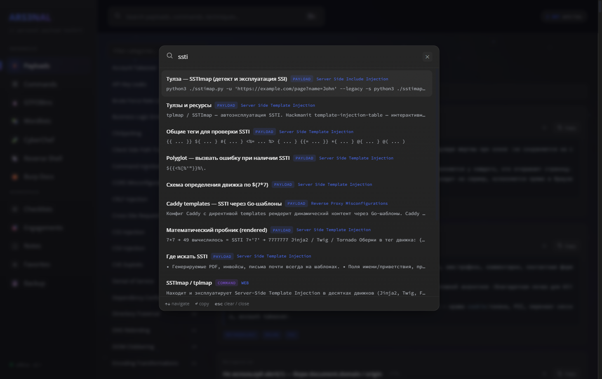
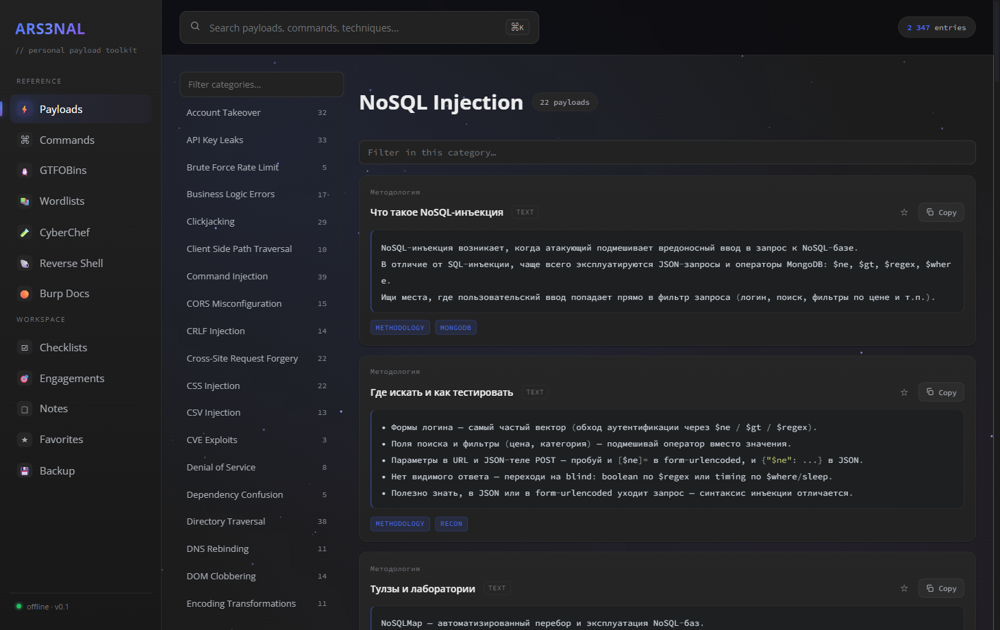
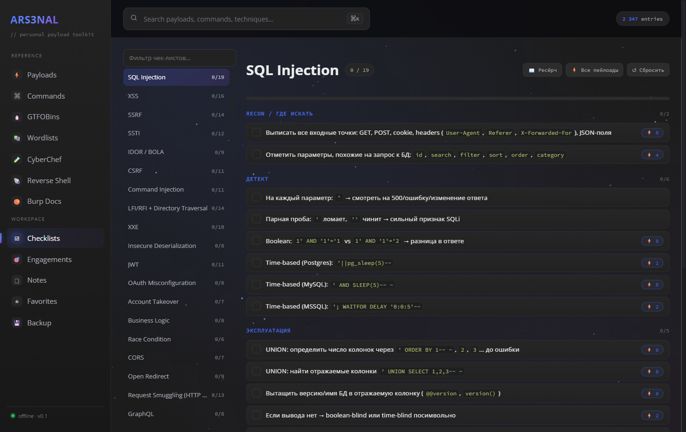

<h1 align="center">ARS3NAL</h1>

<p align="center">
  <b>A local, offline-first arsenal for pentesting &amp; bug bounty.</b><br>
  Payloads, a click-to-build command generator, GTFOBins, wordlists, an embedded CyberChef,
  reverse shells, a Burp reference, operational checklists and an engagement tracker —
  one fast, searchable, editable app that runs entirely on your machine.
</p>

<p align="center">
  
  
  
  
</p>


> No telemetry. No cloud. No account. Your data lives in a local SQLite file and never
> leaves the box. Stop juggling 30 browser tabs and a folder of `.md` cheatsheets.

> ⚠️ **For authorized security testing and education only.** See [Disclaimer](#-disclaimer).

> 🌐 The UI is in **Russian**; payloads, commands and code stay technical / English.

---

## ✨ Highlights

### 🛠️ Command builder — assemble commands by clicking flags
The headline feature. Pick a tool, toggle the flags you want, and the command assembles
itself with **verified, documented flags** (each flag has a Russian explanation). Set your
**Target / LHOST once** in the top bar and it's substituted into *every* tool's examples
live — no more find-and-replace on `10.10.x.x`. Save assembled commands to your own
**“Готовые команды”** library (persists in the DB, drag-to-reorder). 59 tools have the
builder (nmap, ffuf, sqlmap, gobuster, hashcat, …); the rest are rich Markdown references.


### ⌨️ One search across everything
A ⌘K palette that searches **every** payload, command, GTFOBin, wordlist and doc at once
(SQLite FTS5), so you find the thing without remembering which module it lives in.



### ⚡ Curated payloads — 63 categories
Hand-curated from PayloadsAllTheThings (~1500 entries): detection-first ordering, real
copy-ready payloads, diagrams and tables, with Russian tips. Not a noisy auto-dump.



### 🧪 CyberChef — embedded &amp; offline
The full official CyberChef build, embedded right in the app, re-themed to match and with
its UI localized to Russian. Encode/decode/crypto without leaving ARS3NAL or going online.


### 🐧 GTFOBins — all 458, fully translated
Every GTFOBins binary with function/context filter chips (shell, file-read, sudo, SUID…)
and Russian-translated technique notes.


### 🐚 Reverse-shell generator
revshells.com-grade: reverse / bind / msfvenom / listeners, with shell and encoding
selectors (base64 / URL / PowerShell). Your LHOST is shared with the rest of the app.


### ☑️ Operational checklists
70 per-vulnerability checklists (web + AD / cloud / priv-esc / pivoting) you tick off —
progress persists — with a research panel and inline ⚡ payload cross-links per item.



### 🎯 Engagements &amp; findings
A per-target workspace: host / LHOST / scope / notes + a findings tracker (severity,
status, repro) + **Markdown report export**. The active target feeds `{TARGET}` / `{LHOST}`
into the command builder and reverse-shell generator.


### 📚 Wordlists reference &amp; 🟠 Burp reference
A curated guide to the top wordlists (canonical paths + GitHub links + “what each is for”),
and a Russian reference for the Burp Suite desktop workflow.

<p>
  
  
</p>

Plus **Notes** (personal Markdown), **Favorites** (★ across every module) and **Backup**
(export/import the whole DB as one JSON).

---

## 🚀 Run

Double-click **`start.bat`** (first run installs deps, seeds the DB and builds the UI),
then open <http://localhost:7331>.

Or manually (Node.js 18+):

```bash
npm install
npm run seed     # one-time: build data/arsenal.db from the bundled sources
npm run build
npm run start    # http://localhost:7331
```

Dev mode: `npm run dev` (Vite + Fastify with live reload). Tests: `npm test`.

## 🗂️ Layout

- `server/` — Fastify API + SQLite (better-sqlite3, FTS5)
- `seed/` — parsers that build the DB (curated payloads, checklists, commands, Burp docs, GTFOBins, wordlist refs)
- `web/` — Vite + vanilla-TypeScript SPA (no framework)
- `data/arsenal.db` — **your** data; custom entries, notes, engagements and checklist progress are never overwritten by re-seeding, and the DB is git-ignored so nothing personal is ever published.

## 🔒 Privacy

Everything is local. Notes, targets, findings and saved commands live only in
`data/arsenal.db` (git-ignored). The seed pipeline rebuilds all *reference* content from
source, so ignoring the DB loses nothing.

## ⚖️ Disclaimer

ARS3NAL is a reference and productivity tool for **authorized** security testing,
**CTF/learning**, and defensive research. Use it **only** against systems you own or have
explicit written permission to test. You are solely responsible for your actions and for
complying with all applicable laws. The authors accept no liability for misuse or damage.
Full text: [`DISCLAIMER.md`](DISCLAIMER.md).

## 🙏 Acknowledgements

ARS3NAL is mostly a fast, offline, searchable front-end over other people's excellent work.
Huge thanks to:

- **[GTFOBins](https://github.com/GTFOBins/GTFOBins.github.io)** — Unix binary abuse techniques *(GPL-3.0)*
- **[PayloadsAllTheThings](https://github.com/swisskyrepo/PayloadsAllTheThings)** by swisskyrepo &amp; contributors — payloads, methodology, diagrams *(MIT)*
- **[reverse-shell-generator](https://github.com/0dayCTF/reverse-shell-generator)** by Ryan Montgomery / 0dayCTF — reverse/bind/msfvenom/listener data *(MIT)*
- **[CyberChef](https://github.com/gchq/CyberChef)** by GCHQ — embedded offline build *(Apache-2.0)*
- **[SecLists](https://github.com/danielmiessler/SecLists)** by Daniel Miessler — wordlist references *(MIT)*
- **[Burp Suite documentation](https://portswigger.net/burp/documentation)** by PortSwigger — basis for the Burp reference module
- **[Open Sans](https://fonts.google.com/specimen/Open+Sans)** *(Apache-2.0)* and **[Source Code Pro](https://github.com/adobe-fonts/source-code-pro)** by Adobe *(SIL OFL-1.1)* — fonts

Full per-source license details: [`THIRD_PARTY.md`](THIRD_PARTY.md).

## 📄 License

**GPL-3.0** (see [`LICENSE`](LICENSE)) — required because ARS3NAL bundles GPL-3.0 GTFOBins data.
