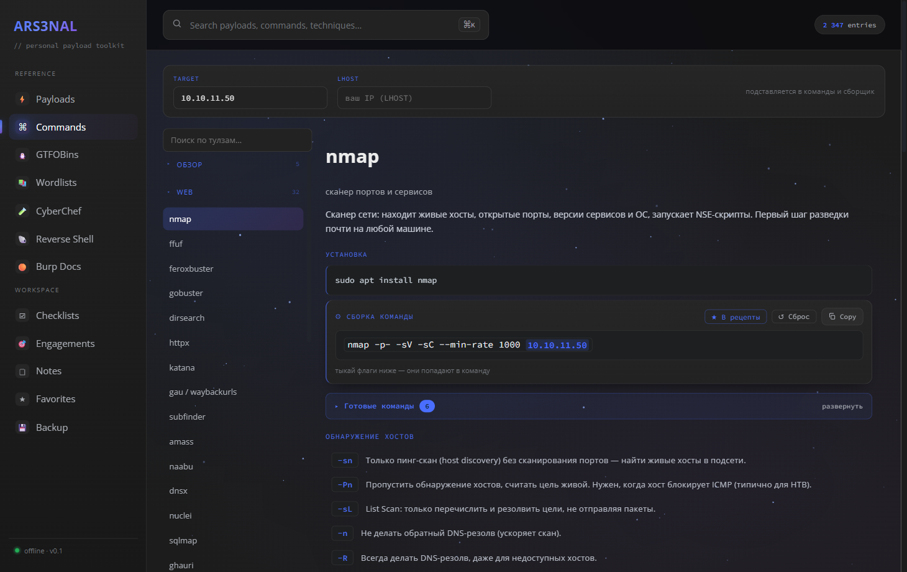
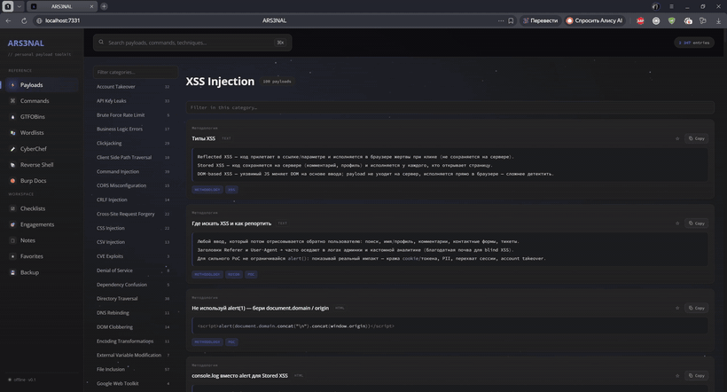
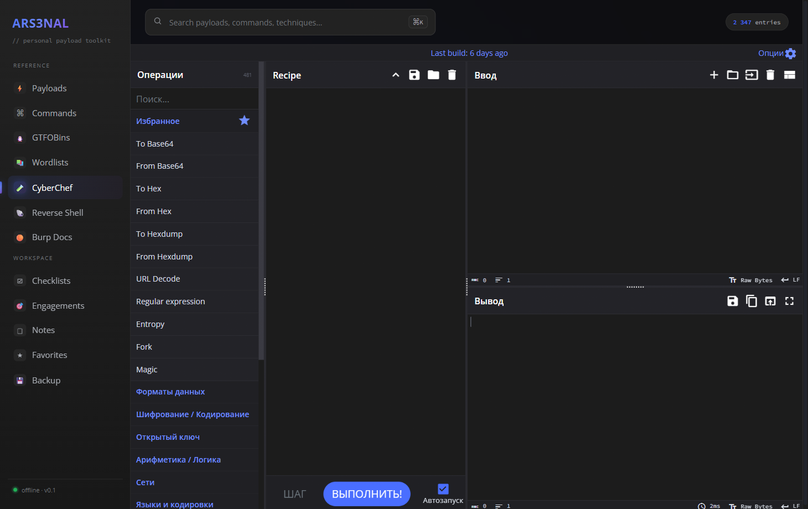
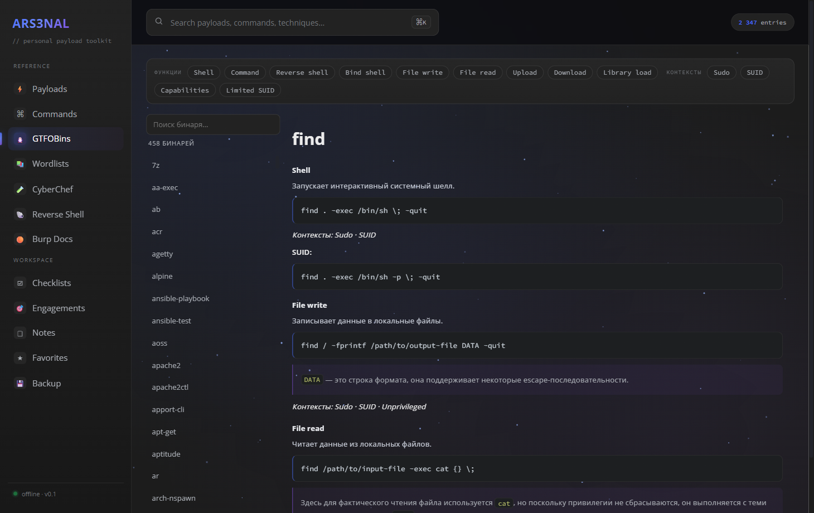
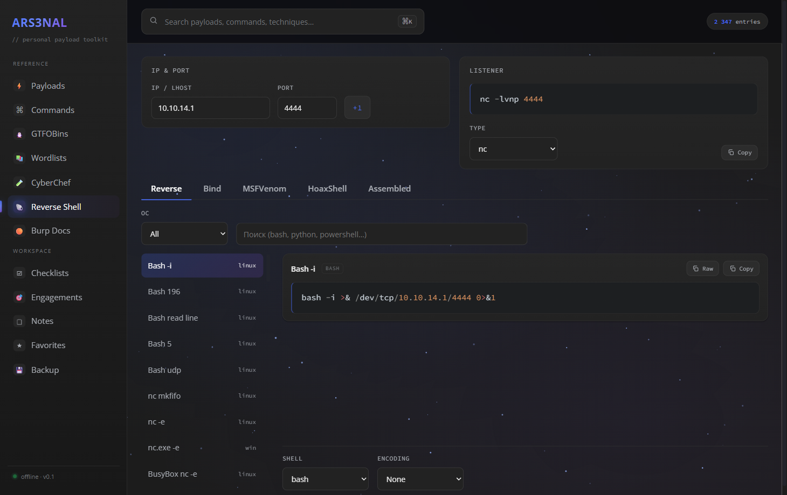
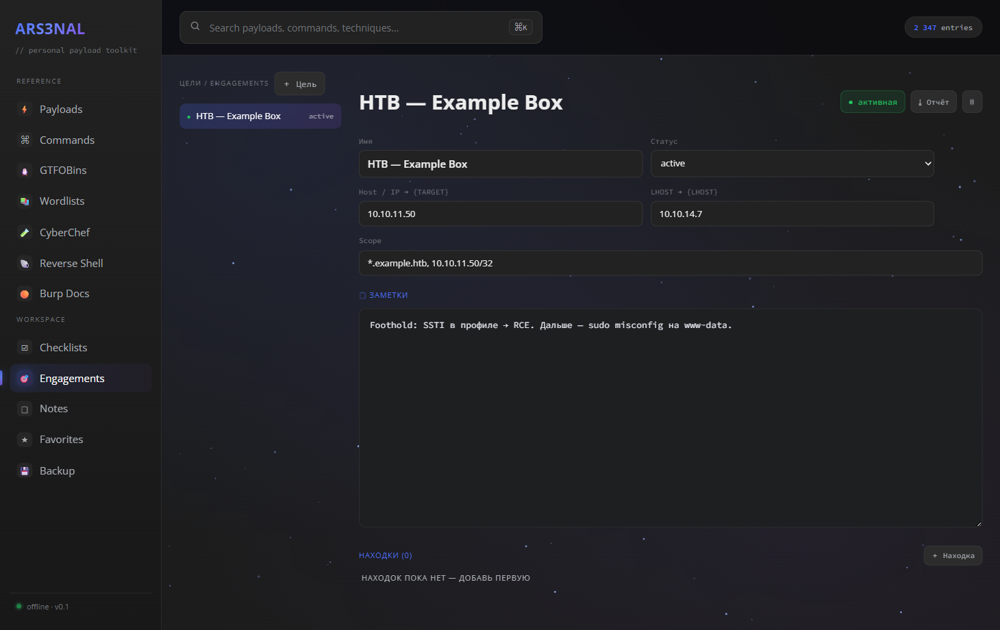
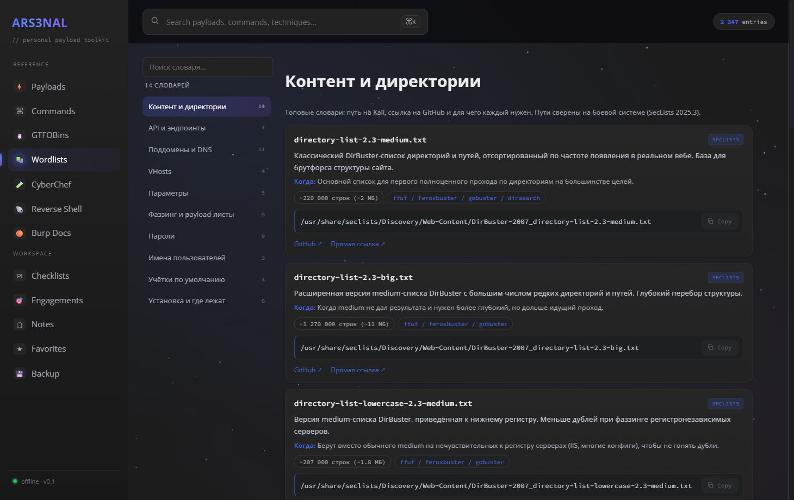
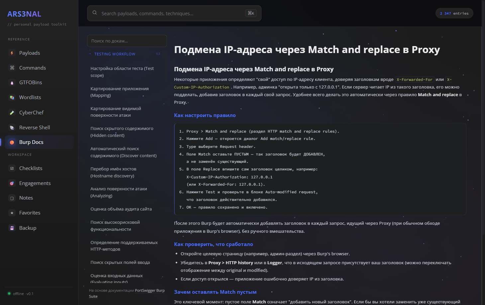

<h1 align="center">ARS3NAL</h1>

<p align="center"><a href="README.md">English</a> · <b>Русский</b></p>

<p align="center">
  <b>Локальный офлайн-арсенал для пентеста и bug bounty.</b><br>
  Payload'ы, конструктор команд по клику, GTFOBins, словари, встроенный CyberChef,
  реверс-шеллы, справка по Burp, операционные чек-листы и трекер энгейджментов:
  одно быстрое приложение с поиском и редактированием, работающее полностью на твоей машине.
</p>

<p align="center">
  
  
  
  
</p>

<p align="center"><b>▶ <a href="https://inflictx.github.io/Arsenal/">Живое демо</a></b>: работает прямо в браузере, ставить ничего не надо (данные остаются у тебя в браузере).</p>


> Никакой телеметрии. Никакого облака. Без аккаунта. Данные лежат в локальном файле SQLite и никуда не уходят. Хватит жонглировать тридцатью вкладками и папкой `.md`-шпаргалок.

> ⚠️ **Только для авторизованного тестирования безопасности и обучения.** См. [Дисклеймер](DISCLAIMER.md).

> 🌐 **Двуязычно (русский / английский)** - переключатель в один клик меняет интерфейс и
> большую часть справочного контента (payload'ы, GTFOBins, команды, Burp-доки, словари)
> между RU и EN. Сами payload'ы, команды и код остаются техническими.

---

## ✨ Возможности

### 🛠️ Конструктор команд: собираешь команду, кликая по флагам
Главная фича. Выбираешь тулзу, отмечаешь нужные флаги, и команда собирается сама из **проверенных, документированных флагов** (у каждого флага пояснение, RU/EN). **Цель и LHOST задаёшь один раз** в шапке, и они подставляются в примеры *всех* тулз вживую, никакого ручного поиска и замены по `10.10.x.x`. Собранные команды сохраняешь в свою библиотеку **«Готовые команды»** (хранится в БД, переупорядочивается перетаскиванием). Конструктор есть у 59 тулз (nmap, ffuf, sqlmap, gobuster, hashcat, ...); остальные идут как подробные Markdown-справки.



### ⌨️ Один поиск по всему
Палитра ⌘K ищет сразу по **всем** payload'ам, командам, GTFOBins, словарям и докам (SQLite FTS5), так что находишь нужное, не вспоминая, в каком модуле оно лежит.


### ⚡ Отобранные payload'ы: 63 категории
Отобраны вручную из PayloadsAllTheThings (~1500 записей): порядок от детекта к эксплуатации, реальные готовые к копированию payload'ы, схемы и таблицы, с подсказками (RU/EN). Не шумный авто-дамп.



### 🧪 CyberChef: встроенный и офлайн
Полная официальная сборка CyberChef прямо в приложении, перекрашена под тему и с интерфейсом на русском. Кодирование/декодирование/крипта, не выходя из ARS3NAL и не уходя в онлайн.



### 🐧 GTFOBins: все 458, RU / EN
Каждый бинарь GTFOBins с фильтрами по функциям и контексту (shell, чтение файлов, sudo, SUID...) и пояснениями к технике на русском и английском.



### 🐚 Генератор реверс-шеллов
Уровня revshells.com: reverse / bind / msfvenom / листенеры, с выбором оболочки и кодирования (base64 / URL / PowerShell). LHOST общий со всем остальным приложением.



### ☑️ Операционные чек-листы
70 чек-листов по уязвимостям (web + AD / облака / privesc / пивотинг), которые отмечаешь галочками, прогресс сохраняется, рядом ресёрч-панель и инлайн ⚡ кросс-ссылки на payload'ы по каждому пункту.


### 🎯 Энгейджменты и находки
Рабочее пространство под каждую цель: host / LHOST / scope / заметки + трекер находок (severity, статус, repro) + **экспорт отчёта в Markdown**. Активная цель подставляет `{TARGET}` / `{LHOST}` в конструктор команд и генератор реверс-шеллов.



### 📚 Справочник словарей и 🟠 справка по Burp
Отобранный гайд по топовым словарям (канонические пути + ссылки на GitHub + «для чего каждый»), и справка по десктоп-воркфлоу Burp Suite (RU/EN).

<p>
  
  
</p>

Плюс **Заметки** (личный Markdown), **Избранное** (★ по всем модулям) и **Бэкап** (экспорт/импорт всей БД одним JSON).

---

## 🚀 Запуск

**Два способа:** [**живое демо**](https://inflictx.github.io/Arsenal/) работает client-only в браузере (справочный контент вшит; твои заметки/цели/прогресс живут в IndexedDB браузера). Для полноценного локального приложения со своей базой SQLite и редактируемым контентом запусти его сам:

Двойной клик по **`start.bat`** (при первом запуске ставит зависимости, сидит БД и собирает UI), потом открой <http://localhost:7331>.

Или вручную (Node.js 18+):

```bash
npm install
npm run seed     # один раз: собрать data/arsenal.db из вшитых исходников
npm run build
npm run start    # http://localhost:7331
```

Dev-режим: `npm run dev` (Vite + Fastify с live reload). Тесты: `npm test`.

## 🗂️ Структура

- `server/` - Fastify API + SQLite (better-sqlite3, FTS5)
- `seed/` - парсеры, собирающие БД (отобранные payload'ы, чек-листы, команды, Burp-доки, GTFOBins, ссылки на словари)
- `web/` - Vite + ванильный TypeScript SPA (без фреймворка)
- `data/arsenal.db` - **твои** данные; кастомные записи, заметки, энгейджменты и прогресс чек-листов не затираются при пересборке, а сама БД в gitignore, так что ничего личного не публикуется.

## 🔒 Приватность

Всё локально. Заметки, цели, находки и сохранённые команды живут только в `data/arsenal.db` (в gitignore). Пайплайн сида пересобирает весь *справочный* контент из исходников, так что игнор БД ничего не теряет.

## ⚖️ Дисклеймер

ARS3NAL это справочный и продуктивный инструмент для **авторизованного** тестирования безопасности, **CTF/обучения** и защитного ресёрча. Используй его **только** против систем, которыми владеешь или на тест которых есть явное письменное разрешение. Ты сам несёшь полную ответственность за свои действия и за соблюдение всех применимых законов. Авторы не несут ответственности за злоупотребление или ущерб. Полный текст: [`DISCLAIMER.md`](DISCLAIMER.md).

## 🙏 Благодарности

ARS3NAL во многом это быстрая офлайн-витрина с поиском над отличной чужой работой. Огромное спасибо:

- **[GTFOBins](https://github.com/GTFOBins/GTFOBins.github.io)** - техники злоупотребления Unix-бинарями *(GPL-3.0)*
- **[PayloadsAllTheThings](https://github.com/swisskyrepo/PayloadsAllTheThings)** от swisskyrepo и контрибьюторов - payload'ы, методология, схемы *(MIT)*
- **[reverse-shell-generator](https://github.com/0dayCTF/reverse-shell-generator)** от Ryan Montgomery / 0dayCTF - данные reverse/bind/msfvenom/listener *(MIT)*
- **[CyberChef](https://github.com/gchq/CyberChef)** от GCHQ - встроенная офлайн-сборка *(Apache-2.0)*
- **[SecLists](https://github.com/danielmiessler/SecLists)** от Daniel Miessler - ссылки на словари *(MIT)*
- **[Burp Suite documentation](https://portswigger.net/burp/documentation)** от PortSwigger - основа модуля справки по Burp
- **[Open Sans](https://fonts.google.com/specimen/Open+Sans)** *(Apache-2.0)* и **[Source Code Pro](https://github.com/adobe-fonts/source-code-pro)** от Adobe *(SIL OFL-1.1)* - шрифты

Полные лицензии по каждому источнику: [`THIRD_PARTY.md`](THIRD_PARTY.md).

## 📄 Лицензия

**GPL-3.0** (см. [`LICENSE`](LICENSE)), требуется потому, что ARS3NAL включает данные GTFOBins под GPL-3.0.
